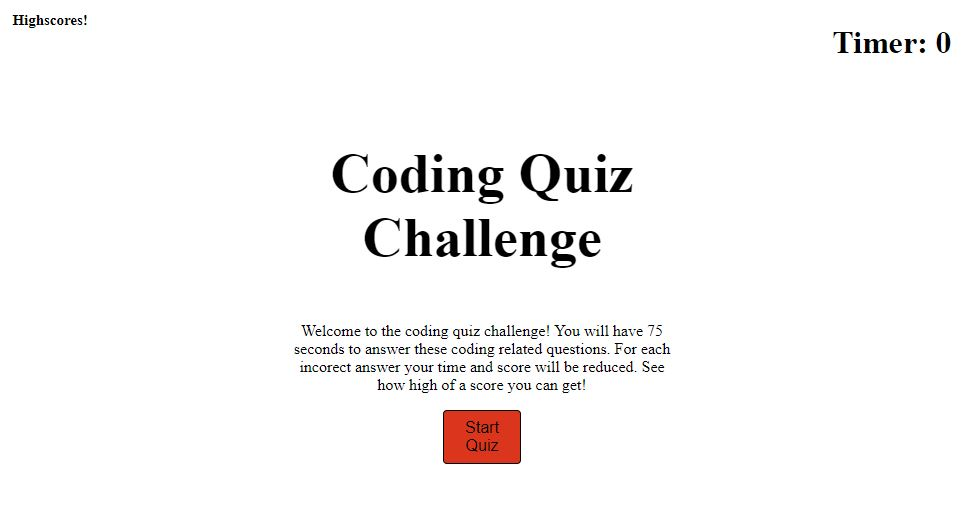
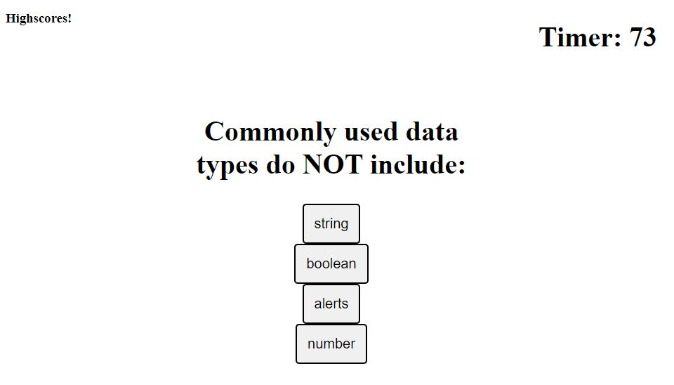
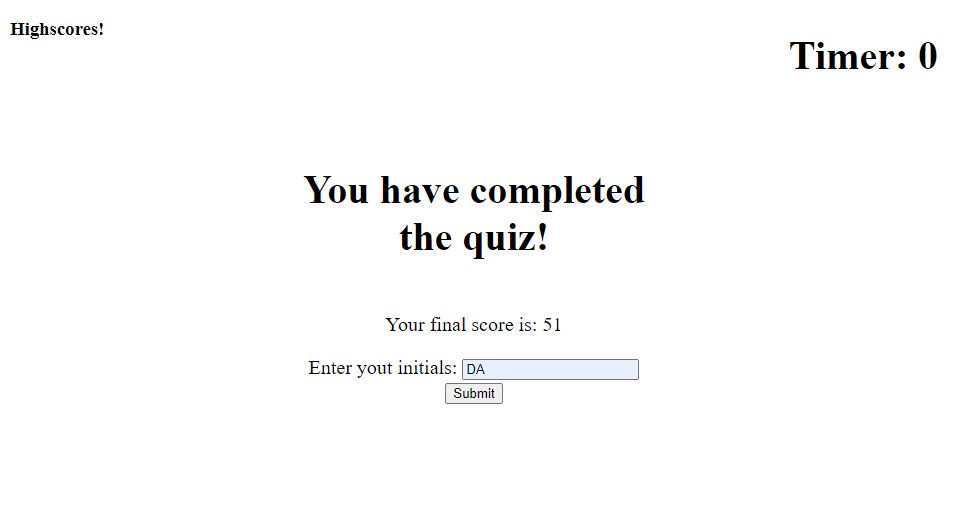

# Week_4_Quiz

## Descprition 

A coding quiz created using HTML, CSS, and JS. When the user navigates to the main page they see a description of the quiz and can click the start button to begin. The quiestions are then displayed on the screen and a score is assigned based on the accuracy of the answers and the time taken. The user is then prompted to enter their initals in order to store their score in local storage. They are then taken to a highscore page where the stored scores are displayed. 

## Links

Link to the repository - https://github.com/Daniel-robe/Week_4_Quiz
Link to the deployed site - https://daniel-robe.github.io/Week_4_Quiz/

## Screenshots

